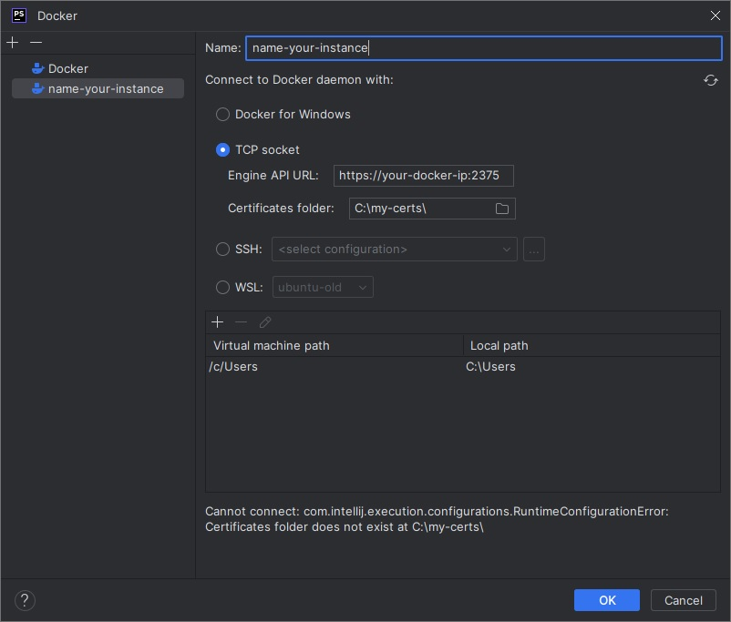

# Docker Certificate Generator

This script generates Certificate Authority (CA), server, and client keys using OpenSSL for securing Docker connections.

Author: [Enes Sönmez](https://github.com/eness)

## Usage

1. Make sure you have OpenSSL installed on your system.

2. Clone or download this repository to your local machine:

   ```bash
   git clone https://github.com/eness/create-docker-certs.git
   ```

3. Navigate to the cloned repository:

   ```bash
   cd create-docker-certs
   ```

4. Open the generate_certs.sh script in a text editor.

5. Replace the `HOST="your_hostname_here"` value with your actual Docker host's hostname.

6. Save the script and give it executable permissions:

   ```bash
   chmod +x create-docker-certs.sh
   ```

7. The generated keys and certificates will be stored in the `./docker-certificates` folder.

8. After you have created certificates, now you need to set docker daemon to require certs on start

   ```bash
   sudo nano /lib/systemd/system/docker.service
   ```

   find lines similar to this :
   ```bash
   [Service]
   Type=notify
   # the default is not to use systemd for cgroups because the delegate issues still
   # exists and systemd currently does not support the cgroup feature set required
   # for containers run by docker
   ExecStart=/usr/bin/dockerd -H fd:// --containerd=/run/containerd/containerd.sock
   ```

   modify it as below, so it would look like :

   ```bash
   [Service]
   Type=notify
   # the default is not to use systemd for cgroups because the delegate issues still
   # exists and systemd currently does not support the cgroup feature set required
   # for containers run by docker
   ExecStart=
   ExecStart=/usr/bin/dockerd -H fd:// -H tcp://0.0.0.0:2375 --tlsverify --tlscacert=/path/to/certs/ca.pem --tlscert=/path/to/certs/server-cert.pem --tlskey=/path/to/certs/server-key.pem
   ```

   then, restart docker daemon :
   
   ```bash
   sudo service docker restart
   ```

9. If you want to connect your docker host using PhpStorm, you should copy `ca.pem`, `cert.pem` and `key.pem` files to your local computer, into a folder (`C:\my-certs` eg.) and create a connection to your instance as shown in the picture.




## Troubleshooting

If your Docker setup is not working properly with the generated certificates and you suspect that the firewall (e.g., ufw) might be causing issues, you can consider allowing incoming connections on port 2375. Here's how you can do that using ufw:

Allow incoming connections on port 2375:

   ```bash
   sudo ufw allow 2375
   ```

This command allows incoming connections on port 2375, which is the default port for the Docker API. Make sure to verify that this port is indeed used for your Docker API in your configuration.

If you're using a secure Docker daemon (with TLS), you might need to allow port 2376 as well:

   ```bash
   sudo ufw allow 2376
   ```

Port 2376 is the default port for a secure Docker daemon that uses TLS for encryption.

After allowing the necessary ports, try connecting to your Docker daemon again and see if the issue is resolved.

Remember that opening ports on your firewall can have security implications, so ensure that you are allowing connections only as needed and that you have taken appropriate security measures, such as using secure certificates and proper authentication methods for Docker.
   

## Important Notes

Adjust the script and certificate settings according to your specific requirements.
Use these certificates responsibly and for intended purposes only.
Remember to configure Docker to use the generated certificates for secure connections.

## Contributing
Feel free to contribute to this project by opening issues or pull requests on the [GitHub repository](https://github.com/eness/create-docker-certs/).

## License
This project is licensed under the MIT License.
